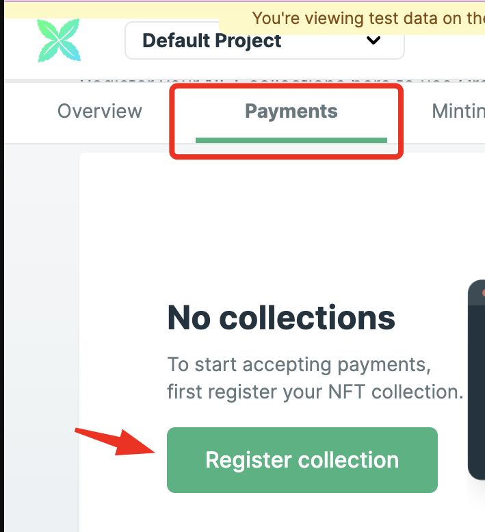
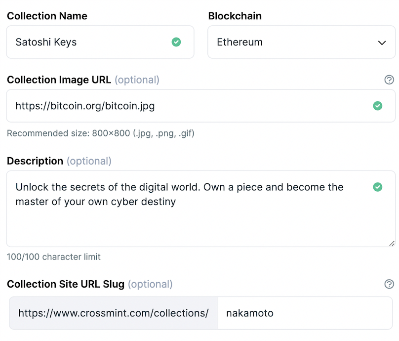

## 1️⃣ Create a developer account 👤

If you haven't yet, start by creating an account on our developer console. https://www.crossmint.com/console/create-account

## 2️⃣ Create a new collection ➕

You're in! The next step is creating a new collection. Click on the "Payments" tab and create a new one.

Now you need to add basic information about your collection. This is important because customers will see this information on the checkout flow! But don't worry, you'll be able to go back and edit it later.

## 3️⃣ Register your smart contract 🔴
- EVM chains (eg. Ethereum, Polygon, BNB, etc): see requirements
- Solana: We support Candy Machine v1, v2, and v3. Contact us for custom contract integration. To register the contract, simply paste the contract ID on the console
- Cardano: We are not yet self-service. Contact us to get you set up!
- Other chains: Contact us if your chain is not available on the console

## 4️⃣ Verify your account ✅

Just one last thing! Quickly verify your identity and the collection. On average, it takes just 2 minutes and 30 seconds. We do this for regulatory reasons, using a reputable third party (Persona), and don't store any personal information ourselves.

Now you're set! It's time to add the payment button to your website 🥳
